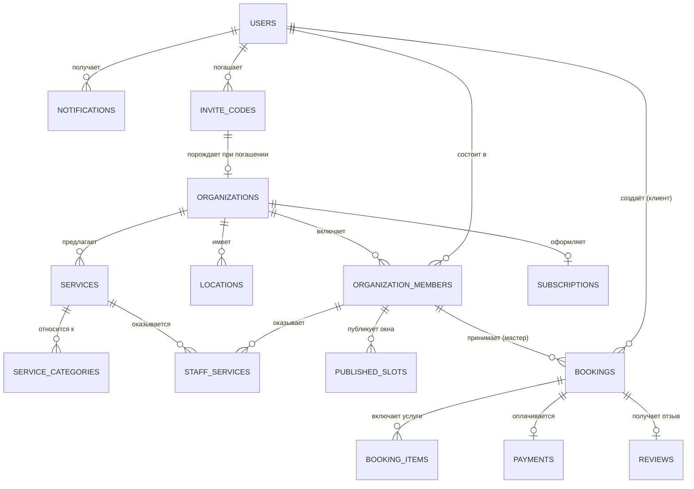

# DATABASE — AMOLIE

Версия 0.3 (черновик для утверждения). СУБД: PostgreSQL (предложение, см. [ARCHITECTURE.md](ARCHITECTURE.md)).

## 1. Принципы проектирования

- Первичные ключи — UUID (v7 предпочтительно, для сортируемости по времени создания).
- Обязательные аудит-поля на всех бизнес-таблицах: `created_at`, `updated_at`, `deleted_at` (soft delete там, где нужна история/восстановление).
- Мультиарендность через `organization_id` на всех тенант-специфичных таблицах + индекс.
- Деньги хранятся в минимальных единицах (центы) как `integer`/`bigint`, никогда как `float`.
- Время — всегда `timestamptz` (UTC в БД), конвертация в локальный часовой пояс организации на уровне Presentation.
- Явные enum-типы для статусов вместо "магических строк".
- Внешние ключи с явно определённым поведением при удалении (`ON DELETE RESTRICT` по умолчанию для бизнес-критичных связей, `CASCADE` только для строго зависимых сущностей типа `booking_service_items`).

## 2. Обзор сущностей

## 3. Таблицы

> **Статус реализации:** `users`, `organizations`, `organization_members`, `registration_requests` реализованы в `apps/api/src/shared/database/schema/` (Drizzle) и применены миграцией `apps/api/drizzle/0000_gifted_carnage.sql`. Остальные таблицы этого раздела — пока только проектная спецификация.

### 3.1. `users`

Единая таблица для всех физических лиц (клиенты, мастера, админы — роль определяется через `organization_members` и системную роль).

| Поле                                 | Тип                     | Описание                                                                                                                        |
| ------------------------------------ | ----------------------- | ------------------------------------------------------------------------------------------------------------------------------- |
| id                                   | uuid, PK                |                                                                                                                                 |
| email                                | citext, unique nullable | Может отсутствовать при регистрации только по телефону                                                                          |
| phone                                | text, unique nullable   | В формате E.164                                                                                                                 |
| password_hash                        | text nullable           | Null для пользователей, вошедших только по OTP                                                                                  |
| full_name                            | text                    |                                                                                                                                 |
| avatar_url                           | text nullable           |                                                                                                                                 |
| locale                               | text                    | `lv`, `ru`, `en`                                                                                                                |
| system_role                          | enum                    | `client`, `master`, `platform_admin` (базовая роль по умолчанию; в рамках организации роль уточняется в `organization_members`) |
| account_status                       | enum                    | `active`, `blocked` — блокировка платформенным админом (TASKS.md AP-3)                                                          |
| token_version                        | integer, default 0      | Генерация выданных access-токенов; инкремент отзывает все сессии (см. ниже)                                                     |
| email_verified_at                    | timestamptz nullable    |                                                                                                                                 |
| phone_verified_at                    | timestamptz nullable    |                                                                                                                                 |
| gdpr_consent_at                      | timestamptz             | Момент согласия на обработку ПДн                                                                                                |
| created_at / updated_at / deleted_at | timestamptz             |                                                                                                                                 |

Ограничение: хотя бы одно из `email`/`phone` обязательно (проверяется на уровне Application-слоя и/или `CHECK`-констрейнтом).

**`token_version` — единственный способ отозвать сессию.** JWT самодостаточен и
подписан, поэтому всё, что отбирает доступ, происходит уже _после_ его выдачи:
админ блокирует мастера, аккаунт удаляют, пароль меняют, потому что он утёк.
Токен об этом не знает. Каждый токен несёт значение, под которым выпущен
(claim `tv`), а `JwtAuthGuard` сверяет его и `account_status` с базой на каждом
запросе — иначе блокировка вступала бы в силу только через 12 часов, что и есть
весь её смысл. Смена пароля инкрементирует версию тем же оператором `UPDATE`,
что пишет хеш: пароль, обновлённый при живых старых токенах, — ровно то
состояние, из которого спасают скомпрометированный аккаунт.

Цена — один поиск по первичному ключу на аутентифицированный запрос; это
осознанный обмен корректности отзыва на запрос при текущем масштабе. Токены,
выпущенные до появления версии, `tv` не несут — отсутствие читается как
начальная генерация, чтобы правка не завершила все живые сессии при деплое.

### 3.2. `organizations`

Соло-мастер или салон.

| Поле                                        | Тип                             | Описание                                                                                                                                                                                                          |
| ------------------------------------------- | ------------------------------- | ----------------------------------------------------------------------------------------------------------------------------------------------------------------------------------------------------------------- |
| id                                          | uuid, PK                        |                                                                                                                                                                                                                   |
| owner_user_id                               | uuid, FK → users                |                                                                                                                                                                                                                   |
| name                                        | text                            |                                                                                                                                                                                                                   |
| slug                                        | text, unique (case-insensitive) | Username поддомена: `{slug}.amolie.com` — публичная страница записи и `/dashboard` организации (см. [ARCHITECTURE.md](ARCHITECTURE.md) §3)                                                                        |
| type                                        | enum                            | `solo`, `salon`                                                                                                                                                                                                   |
| description                                 | text nullable                   |                                                                                                                                                                                                                   |
| logo_url / cover_url                        | text nullable                   |                                                                                                                                                                                                                   |
| default_locale                              | text                            |                                                                                                                                                                                                                   |
| timezone                                    | text                            | IANA timezone, напр. `Europe/Riga`                                                                                                                                                                                |
| contact_email / contact_phone               | text nullable                   |                                                                                                                                                                                                                   |
| address_line / city / instagram_handle      | text nullable                   | Публичная страница мастера (см. [CHANGELOG.md](CHANGELOG.md) Модуль 7)                                                                                                                                            |
| show_prices_section / show_contacts_section | boolean, default true           | Видимость разделов на публичной странице                                                                                                                                                                          |
| auto_confirm_bookings                       | boolean, default false          | `false` — новая запись получает статус `pending` и ждёт ручного подтверждения мастером; `true` — сразу `confirmed`                                                                                                |
| page_design                                 | jsonb nullable                  | Опубликованные решения Студии по десяти ручкам ([DESIGN_STUDIO.md](DESIGN_STUDIO.md) §7.1). `null` — страница не переезжала в Студию, и её облик резолвится из полей оформления выше (§7.5)                       |
| page_design_draft                           | jsonb nullable                  | Черновик Студии: то, что видит мастер на холсте. `null` — черновик совпадает с опубликованным                                                                                                                     |
| custom_design_key                           | text nullable                   | Заказной мир, выданный этой организации персонально ([DESIGN_STUDIO.md](DESIGN_STUDIO.md) §7.4a). Единственный ключ вне предложения каталога, который ей разрешено на себя поставить. `null` — не выдавали ничего |
| slug_chosen_at                              | timestamptz nullable            | Когда мастер выбрала адрес сама. `null` — слаг всё ещё тот, что регистрация вывела из её имени, то есть заглушка, а не решение                                                                                    |
| onboarding_completed_at                     | timestamptz nullable            | Когда пошаговая настройка завершена или закрыта. Отдельные шаги не хранятся — они выводятся из данных (см. [API.md](API.md) §6.1)                                                                                 |
| status                                      | enum                            | `active`, `suspended`, `archived`                                                                                                                                                                                 |
| created_at / updated_at / deleted_at        |                                 |                                                                                                                                                                                                                   |

**`client_cancellation_hours`** (миграция `0036_client-cancellation`) — за сколько
часов до визита клиент может отменить его сам. `null` — не может вовсе, и это
умолчание: до сих пор отменял только мастер, и включать чужой календарь на
самообслуживание без её ведома нельзя. Ноль — можно до самого начала. Часы, а не
флаг: час до визита и сутки до визита — разные события для того, кто продаёт своё
время.

### 3.2a. `page_design_versions`

История публикаций облика страницы ([DESIGN_STUDIO.md](DESIGN_STUDIO.md) §7.3).
Строки только добавляются: откат — это новая публикация старого слепка, а не
переписывание истории.

| Поле                  | Тип                       | Описание                                                         |
| --------------------- | ------------------------- | ---------------------------------------------------------------- |
| id                    | uuid, PK                  |                                                                  |
| organization_id       | uuid, FK → organizations  | `on delete cascade`                                              |
| version               | integer                   | Порядковый номер публикации внутри организации                   |
| design                | jsonb                     | Слепок решений по ручкам целиком, а не диф                       |
| published_by_user_id  | uuid nullable, FK → users | `on delete set null`                                             |
| reverted_from_version | integer nullable          | Номер версии, копией которой является публикация, если это откат |
| published_at          | timestamptz               |                                                                  |

Индекс `(organization_id, published_at)` — единственный запрос к таблице
«последние десять этой организации».

### 3.2b. `organization_slug_history`

Каждый адрес, на который организация когда-либо отвечала.

Слаг мастера напечатан на визитках, вставлен в шапку Instagram и сохранён в
браузерах её клиентов. Разрешить переименование правильно — автоматический
адрес из регистрации это заглушка, — но переименование, превращающее всё
перечисленное в 404, это потеря, о которой мастер узнаёт от переставшего
приходить клиента. Поэтому прежний адрес остаётся здесь и продолжает работать:
публичная страница резолвится через эту таблицу и отвечает постоянным
редиректом (308) на текущий слаг.

| Поле            | Тип                      | Описание                                           |
| --------------- | ------------------------ | -------------------------------------------------- |
| id              | uuid, PK                 |                                                    |
| organization_id | uuid, FK → organizations |                                                    |
| slug            | text, unique             | Адрес, который раньше был живым. Уникален навсегда |
| created_at      | timestamptz              | Момент переименования                              |

Уникальность платформенная, а не внутри организации: строка одновременно
мешает постороннему занять только что освобождённый адрес и унаследовать
чужой трафик. Занятость нового адреса проверяется по обеим таблицам —
`organizations.slug` и этой (`OrganizationSlugRepository.isTaken`).

Хранится не более пяти прежних адресов на организацию: каждый удерживаемый
адрес — тот, который никто на платформе больше не получит, и неограниченная
история превращает переименование в способ копить имена. Хвост удаляется при
следующем переименовании; вместе с лимитом «3 смены за 30 дней» это держит
намерение — сменить адрес — отделённым от злоупотребления.

### 3.3. `locations`

Физические адреса организации (для салонов с несколькими точками).

| Поле                                     | Тип              |
| ---------------------------------------- | ---------------- |
| id                                       | uuid, PK         |
| organization_id                          | uuid, FK         |
| name                                     | text             |
| address_line, city, postal_code, country | text             |
| geo_lat, geo_lng                         | numeric nullable |
| is_primary                               | boolean          |

### 3.4. `organization_members`

Связь пользователя с организацией + роль внутри неё.

> Реализовано (см. TASKS.md O-1) без `location_id` — колонка добавится миграцией вместе с таблицей `locations` в рамках O-4, чтобы не создавать FK на несуществующую таблицу раньше времени.

| Поле                                 | Тип               | Описание                                                           |
| ------------------------------------ | ----------------- | ------------------------------------------------------------------ |
| id                                   | uuid, PK          |                                                                    |
| organization_id                      | uuid, FK          |                                                                    |
| user_id                              | uuid, FK          |                                                                    |
| role                                 | enum              | `owner`, `admin`, `master`                                         |
| location_id (Phase O-4)              | uuid, FK nullable | Основная локация мастера                                           |
| display_name                         | text nullable     | Имя, отображаемое клиентам (может отличаться от `users.full_name`) |
| bio                                  | text nullable     |                                                                    |
| status                               | enum              | `active`, `invited`, `disabled`                                    |
| created_at / updated_at / deleted_at |                   |                                                                    |

### 3.5. `service_categories`

Один уровень вложенности: «Стрижка» → «Fader cut». Дерева нет сознательно —
рекурсивные запросы и редактор перетаскиванием не окупаются ни одним реальным
каталогом красоты.

| Поле                                 | Тип               | Описание                                                            |
| ------------------------------------ | ----------------- | ------------------------------------------------------------------- |
| id                                   | uuid, PK          |                                                                     |
| organization_id                      | uuid, FK          |                                                                     |
| name                                 | text              |                                                                     |
| sort_order                           | integer default 0 | Порядок, заданный мастером; ничьи разрешаются по `created_at`       |
| is_active                            | boolean           | Скрытая категория пропадает со страницы записи, услуги внутри — нет |
| created_at / updated_at / deleted_at |                   | Удаление мягкое и в той же транзакции отвязывает услуги             |

### 3.6. `services`

| Поле                                 | Тип               | Описание                                                           |
| ------------------------------------ | ----------------- | ------------------------------------------------------------------ |
| id                                   | uuid, PK          |                                                                    |
| organization_id                      | uuid, FK          |                                                                    |
| category_id                          | uuid, FK nullable | `on delete set null` — потеря группировки не должна уносить работу |
| name                                 | text              |                                                                    |
| description                          | text nullable     |                                                                    |
| duration_minutes                     | integer           |                                                                    |
| buffer_after_minutes                 | integer default 0 | Время на подготовку/уборку после услуги                            |
| price_amount                         | integer           | В центах                                                           |
| price_currency                       | text              | ISO 4217, напр. `EUR`                                              |
| price_type                           | enum              | `fixed`, `from`                                                    |
| is_active                            | boolean           |                                                                    |
| created_at / updated_at / deleted_at |                   |                                                                    |

### 3.6b. `booking_slots`

Все окна, которые занимает визит. `published_slots` не хранит длительность —
окно это «визит может начаться здесь» (PRD.md §7.4), — поэтому длинная запись
раньше оставляла окна под собой свободными.

`bookings.published_slot_id` остаётся окном **начала** визита (по нему идут все
чтения `starts_at`), а эта таблица описывает полную занятость, включая
стартовое окно.

| Поле              | Тип                  | Описание                                      |
| ----------------- | -------------------- | --------------------------------------------- |
| id                | uuid, PK             |                                               |
| booking_id        | uuid, FK             |                                               |
| published_slot_id | uuid, FK             |                                               |
| created_at        | timestamptz          |                                               |
| released_at       | timestamptz nullable | Проставляется при отмене; строка не удаляется |

Частичный уникальный индекс `unique (published_slot_id) where released_at is
null` — не более одного неснятого удержания на окно. Это и есть запрет двойной
записи на уровне БД.

### 3.6c. `service_addons`

Что мастер предлагает добавить к услуге: «стрижка машинкой → подстричь заодно
бороду?».

| Поле             | Тип      | Описание              |
| ---------------- | -------- | --------------------- |
| id               | uuid, PK |                       |
| service_id       | uuid, FK | Что клиент выбрал     |
| addon_service_id | uuid, FK | Что предложить сверху |
| sort_order       | integer  | Порядок предложений   |
| created_at       |          |                       |

Связь **направленная**: предложить бороду после стрижки — разумно, обратное —
отдельное решение, и мастер принимает каждое сама. Уникальный индекс на пару и
CHECK `service_id <> addon_service_id`: услуга, предлагающая саму себя, после
согласия молча удвоила бы длительность визита.

Предложения **на один шаг**, рекурсии нет: доп, который тянет свои допы,
превращает запись в лабиринт.

### 3.7. `staff_services`

Какие мастера оказывают какие услуги, с возможным переопределением цены/длительности.

| Поле                      | Тип              |
| ------------------------- | ---------------- |
| id                        | uuid, PK         |
| organization_member_id    | uuid, FK         |
| service_id                | uuid, FK         |
| duration_override_minutes | integer nullable |
| price_override_amount     | integer nullable |

Уникальность: (`organization_member_id`, `service_id`).

### 3.8. `published_slots`

**Продуктовое решение MVP (см. PRD.md §7.4):** без рабочих часов и расписания. Мастер вручную публикует конкретные окна, когда готова принять клиента — по одному. Клиент видит только то, что явно опубликовано.

| Поле                    | Тип                   | Описание                                               |
| ----------------------- | --------------------- | ------------------------------------------------------ |
| id                      | uuid, PK              |                                                        |
| organization_member_id  | uuid, FK              | Мастер, опубликовавший окно                            |
| starts_at               | timestamptz           | Момент начала окна                                     |
| status                  | enum                  | `available`, `booked`                                  |
| hidden_at               | timestamptz, nullable | Окно снято с публичной страницы, но осталось у мастера |
| created_at / updated_at | timestamptz           |                                                        |

Уникальность: (`organization_member_id`, `starts_at`) — нельзя опубликовать два окна на один и тот же момент.

**`hidden_at` — отдельное поле, а не третье значение `status`.** Скрытость и
занятость отвечают на разные вопросы к одному окну: «видно ли снаружи» и
«продано ли». Сложением их в один перечень пришлось бы переписывать частичный
индекс «одна активная запись на окно» и перечитывать каждый `status =
'available'` в репозитории. Время вместо флага: мастер, вернувшись к скрытому
окну, видит, когда сама его убрала.

Скрытое окно не отдаётся ни `public-availability`, ни поиску по длительности,
ни по идентификатору из прежнего ответа (идентификаторы окон публичны). В
кабинете мастера оно остаётся и помечено пунктиром: записать в него человека
вручную она по-прежнему может — скрытие снимает время с витрины, а не запрещает
его самой мастеру. Занятое окно скрыть нельзя: у клиента на руках подтверждение
с этим часом.

**Реализовано во frontend** (`apps/web/src/features/public-profile/mock-data.ts`) на статичных mock-данных, повторяющих эту форму, до готовности реального backend-модуля.

### 3.9. `bookings`

Запись клиента. Одна запись может включать несколько услуг (`booking_items`).

| Поле                                   | Тип                                                 | Описание                                                                                                                                                                                 |
| -------------------------------------- | --------------------------------------------------- | ---------------------------------------------------------------------------------------------------------------------------------------------------------------------------------------- |
| id                                     | uuid, PK                                            |                                                                                                                                                                                          |
| organization_id                        | uuid, FK                                            |                                                                                                                                                                                          |
| organization_member_id                 | uuid, FK                                            | Мастер                                                                                                                                                                                   |
| published_slot_id                      | uuid, FK                                            | Окно **начала** визита (см. §3.8) — источник даты/времени. Всё, что визит занимает, перечислено в `booking_slots` (§3.6b)                                                                |
| public_token                           | uuid, unique, not null, default `gen_random_uuid()` | Единственный ключ гостя к собственной записи — см. врезку ниже                                                                                                                           |
| client_user_id                         | uuid, FK nullable                                   | Аккаунт клиента, если он вошёл в свой кабинет и запись к нему привязана (API.md §6.7a). Null у гостевой записи. Свой индекс: кабинет спрашивает «все мои визиты», не называя организации |
| guest_name / guest_phone / guest_email | text nullable                                       | Для гостевой записи                                                                                                                                                                      |
| guest_instagram                        | text nullable                                       | Сырое значение как ввёл гость/мастер — только для отображения, для дедупа/блокировки используется нормализованный `clients.instagram_handle`                                             |
| location_id                            | uuid, FK                                            |                                                                                                                                                                                          |
| status                                 | enum                                                | `pending`, `confirmed`, `completed`, `cancelled_by_client`, `cancelled_by_master`, `no_show`, `expired`                                                                                  |
| cancellation_reason                    | text nullable                                       |                                                                                                                                                                                          |
| source                                 | enum                                                | `public_page`, `admin_manual`, `marketplace`                                                                                                                                             |
| idempotency_key                        | text unique nullable                                | Защита от дублей при создании                                                                                                                                                            |
| notes                                  | text nullable                                       | Заметка мастера                                                                                                                                                                          |
| created_at / updated_at / deleted_at   |                                                     |                                                                                                                                                                                          |

**`public_token` — почему он есть.** Аккаунтов у клиентов нет, поэтому после
закрытия вкладки вернувшегося гостя нечем опознать: без токена он не может ни
узнать, подтвердила ли мастер запись, ни получить календарный файл именно своей
записи. Значение случайное и уникальное — знание одного токена ничего не говорит
об остальных. Неверный токен отдаёт `404`, неотличимый от удалённой записи:
эндпоинт не должен становиться способом узнать, существует ли чужая запись.

**Ограничение целостности:** уникальный индекс на `published_slot_id` — частичный,
только среди активных записей (`status NOT IN ('cancelled_by_client',
'cancelled_by_master')`): отменённая запись обязана освободить окно по-настоящему,
а не только в `published_slots.status`. Гонка при одновременном бронировании решается на уровне `published_slots.status` атомарным условным обновлением, см. [ARCHITECTURE.md](ARCHITECTURE.md) §6 — без exclusion constraint над временными диапазонами.

### 3.10. `booking_items`

Конкретные услуги внутри записи (снапшот цены/длительности на момент бронирования — важно для истории, т.к. `services` может измениться позже).

| Поле                      | Тип      |
| ------------------------- | -------- |
| id                        | uuid, PK |
| booking_id                | uuid, FK |
| service_id                | uuid, FK |
| service_name_snapshot     | text     |
| duration_minutes_snapshot | integer  |
| price_amount_snapshot     | integer  |
| price_currency_snapshot   | text     |

### 3.11. `payments`

| Поле                    | Тип      | Описание                                                           |
| ----------------------- | -------- | ------------------------------------------------------------------ |
| id                      | uuid, PK |                                                                    |
| booking_id              | uuid, FK |                                                                    |
| type                    | enum     | `deposit`, `full_payment`                                          |
| amount                  | integer  | В центах                                                           |
| currency                | text     |                                                                    |
| provider                | enum     | `stripe`                                                           |
| provider_payment_id     | text     |                                                                    |
| status                  | enum     | `pending`, `succeeded`, `failed`, `refunded`, `partially_refunded` |
| created_at / updated_at |          |                                                                    |

### 3.12. `subscriptions`

Биллинг платформы (подписка организации на тариф AMOLIE).

| Поле                     | Тип                                                 |
| ------------------------ | --------------------------------------------------- |
| id                       | uuid, PK                                            |
| organization_id          | uuid, FK                                            |
| plan                     | enum (`free`, `starter`, `pro`, `business`)         |
| status                   | enum (`active`, `trialing`, `past_due`, `canceled`) |
| provider_subscription_id | text                                                |
| current_period_end       | timestamptz                                         |
| created_at / updated_at  |                                                     |

### 3.13. `reviews`

| Поле                    | Тип              |
| ----------------------- | ---------------- |
| id                      | uuid, PK         |
| booking_id              | uuid, FK, unique |
| rating                  | smallint         | 1–5 |
| comment                 | text nullable    |
| master_reply            | text nullable    |
| is_published            | boolean          |
| created_at / updated_at |                  |

### 3.14. `notifications` — **планируется**

Журнал отправленных сообщений и очередь повторов (TASKS.md N-1). Таблицы ещё
нет: единственное реализованное уведомление — push мастеру о новой записи —
отправляется сразу и не журналируется (см. 3.14a).

| Поле       | Тип                                                                                                      |
| ---------- | -------------------------------------------------------------------------------------------------------- |
| id         | uuid, PK                                                                                                 |
| user_id    | uuid, FK nullable                                                                                        |
| booking_id | uuid, FK nullable                                                                                        |
| channel    | enum (`email`, `sms`, `push`)                                                                            |
| type       | enum (`booking_created`, `booking_confirmed`, `booking_reminder`, `booking_cancelled`, `review_request`) |
| status     | enum (`queued`, `sent`, `failed`)                                                                        |
| payload    | jsonb                                                                                                    |
| sent_at    | timestamptz nullable                                                                                     |
| created_at | timestamptz                                                                                              |

### 3.14a. `push_subscriptions`

Подписки браузера на Web Push — по строке на устройство мастера. Реализована
(миграция `0034_push-subscriptions`).

| Поле         | Тип              | Описание                                                               |
| ------------ | ---------------- | ---------------------------------------------------------------------- |
| id           | uuid, PK         |                                                                        |
| user_id      | uuid, FK → users | Кому пришлют уведомление; организация ни при чём — подписка у человека |
| endpoint     | text, unique     | Адрес, выданный push-сервисом (FCM/Mozilla/Apple) этой установке       |
| p256dh       | text             | Открытый ключ устройства (RFC 8291) — им шифруется тело                |
| auth         | text             | Секрет аутентификации подписки                                         |
| user_agent   | text nullable    | Чтобы мастер узнала своё устройство в списке                           |
| created_at   | timestamptz      |                                                                        |
| last_seen_at | timestamptz      | Обновляется при каждом переподписывании кабинета                       |

Уникальность по `endpoint`, а не по паре с пользователем: адрес принадлежит
установке браузера. Повторная подписка обновляет строку (включая `user_id` —
на общем устройстве уведомления следуют за тем, кто вошёл), иначе одно
уведомление пришло бы мастеру столько раз, сколько раз она открывала кабинет.

Мёртвые строки удаляются по ответу push-сервиса `404`/`410` в момент отправки:
подписка протухает молча, и узнать об этом можно только попыткой написать.

### 3.14b. `user_tokens`

Одноразовые ссылки, которые уходят человеку на почту: подтверждение адреса,
восстановление пароля, вход клиента и переход клиента в мастера. Реализована
(миграции `0030_user-tokens`, `0035_client-account`,
`0040_master-upgrade-tokens`).

| Поле                    | Тип                  | Описание                                                                   |
| ----------------------- | -------------------- | -------------------------------------------------------------------------- |
| id                      | uuid, PK             |                                                                            |
| user_id                 | uuid, FK → users     | Чей это ключ                                                               |
| purpose                 | enum                 | `email_verification`, `password_reset`, `client_sign_in`, `master_upgrade` |
| token_hash              | text, unique         | SHA-256 от токена — сам токен живёт только в письме и в адресной строке    |
| booking_id              | uuid, FK nullable    | Только у `client_sign_in`: запись, со страницы которой начат вход          |
| registration_request_id | uuid, FK nullable    | Только у `master_upgrade`: заявка, из которой растёт повышение             |
| expires_at              | timestamptz          |                                                                            |
| used_at                 | timestamptz nullable | Проставляется при погашении: повторный переход по ссылке не сработает      |
| created_at              | timestamptz          |                                                                            |

**Хранится хеш, а не токен.** Утечка таблицы не должна давать доступ к аккаунтам.
SHA-256, а не argon2: токен генерируем мы, в нём 256 бит случайности и перебирать
нечего, зато проверка обязана быть дешёвой — иначе сама станет вектором на CPU.

**Зачем `booking_id`.** Email при записи необязателен. Гость, который его не
оставил, вводит адрес на странице своей записи — и связать эту запись с будущим
аккаунтом больше нечем: по адресу она не найдётся, его в ней нет. Контекст живёт
в строке таблицы, а не в ссылке письма: всё, что попало в адресную строку, человек
может подменить.

**Зачем `master_upgrade`.** Одобрение заявки от человека, у которого на этот
адрес уже есть аккаунт клиента, не заводит второй аккаунт (почта уникальна) и не
превращает существующий в мастерский сразу: адрес при подаче заявки не
проверяется, и заявку с чужим адресом отправляет кто угодно. Ссылка уходит на сам
адрес, и повышение делает тот, кто читает эту почту. Заявка названа в строке
таблицы, а не в ссылке: искать её по адресу в момент перехода нельзя — за это
время адрес мог собрать вторую и третью заявку, и «последняя одобренная» однажды
выберет не ту.

Одна таблица на четыре случая, а не четыре почти одинаковых: жизненный цикл общий —
выдан, отправлен, разово погашен или протух, — и правило «использованный не
годится» должно существовать в одном месте. Выдача нового токена гасит прежние
того же назначения: старое письмо из чужого ящика перестаёт быть ключом.

### 3.15. `registration_requests`

Заявки на регистрацию мастеров (см. [ARCHITECTURE.md](ARCHITECTURE.md) §10.1). Пришли на смену инвайт-кодам: код требовал, чтобы платформа первой нашла мастера и что-то ей отправила, а заявка позволяет мастеру постучаться самой.

| Поле                                      | Тип                           | Описание                                                          |
| ----------------------------------------- | ----------------------------- | ----------------------------------------------------------------- |
| id                                        | uuid, PK                      |                                                                   |
| full_name / email / phone / locale        | text                          | Данные будущего аккаунта; email и phone нормализованы приложением |
| password_hash                             | text nullable                 | argon2, только до решения — одобрение и отказ его стирают         |
| message                                   | text nullable                 | Что мастер написала о себе — по этому заявку и разбирают          |
| status                                    | enum                          | `pending`, `approved`, `rejected`                                 |
| decided_at / decided_by_user_id           | timestamptz / uuid FK → users | Кто и когда решил                                                 |
| rejection_reason                          | text nullable                 | Уходит заявителю письмом                                          |
| created_user_id / created_organization_id | uuid, FK, nullable            | Что вышло из одобрения                                            |
| created_at / updated_at                   |                               |                                                                   |

Частичный уникальный индекс `registration_requests_pending_email_unique` на `email WHERE status = 'pending'`: одна открытая заявка на адрес. Полного уникального индекса нет намеренно — человек, которому отказали, имеет право прийти снова.

Решение принимается условным `UPDATE ... WHERE status = 'pending'`: два администратора, открывшие очередь одновременно, иначе завели бы два аккаунта на один адрес.

### 3.16. `announcements` и `announcement_dismissals`

Единственный канал, которым платформа говорит со всеми мастерами сразу.

| Поле                                 | Тип                   | Описание                                                |
| ------------------------------------ | --------------------- | ------------------------------------------------------- |
| id                                   | uuid, PK              |                                                         |
| title / body                         | text                  | Текст объявления                                        |
| starts_at                            | timestamptz, not null | Начало показа; по умолчанию — сейчас                    |
| ends_at                              | timestamptz nullable  | `null` — показывать, пока не снимут руками              |
| created_by_user_id                   | uuid, FK → users      | Кто опубликовал                                         |
| created_at / updated_at / deleted_at |                       | Снятие мягкое — отметки о прочтении ссылаются на строку |

`announcement_dismissals` — составной первичный ключ `(announcement_id, user_id)`:
строка появляется один раз и никогда не меняется, суррогатный id ей не нужен.
Отметка живёт на сервере, а не в браузере: мастер работает с телефона и с
ноутбука, и закрытое на одном не должно возвращаться на другом.

Объявление живёт **отрезком времени, а не флагом «опубликовано»**: то, что про
завтрашнее обновление, обязано исчезнуть послезавтра само.

### 3.17. `audit_log`

| Поле                    | Тип               |
| ----------------------- | ----------------- |
| id                      | uuid, PK          |
| organization_id         | uuid, FK nullable |
| actor_user_id           | uuid, FK nullable |
| action                  | text              |
| entity_type / entity_id | text / uuid       |
| metadata                | jsonb             |
| created_at              | timestamptz       |

### 3.18. `jobs`

Очередь фоновых задач — в той же базе, что и всё остальное
([ARCHITECTURE.md](ARCHITECTURE.md) §12). Появилась ради писем о записях: слать
их прямо из обработчика запроса нельзя, иначе недоступный почтовый провайдер
роняет саму запись.

| Поле                    | Тип                   | Описание                                                       |
| ----------------------- | --------------------- | -------------------------------------------------------------- |
| id                      | uuid, PK              |                                                                |
| kind                    | text                  | `booking.created`, `booking.reminder` и подобные               |
| payload                 | jsonb                 | Идентификаторы, а не снимки данных                             |
| status                  | enum                  | `pending`, `running`, `done`, `failed`                         |
| run_at                  | timestamptz           | Не раньше этого момента; для напоминания — визит минус N часов |
| attempts / max_attempts | integer               | По умолчанию 5 попыток                                         |
| dedupe_key              | text, nullable        | Ключ, по которому задача не задваивается                       |
| last_error              | text, nullable        | Последняя причина отказа                                       |
| started_at              | timestamptz, nullable | Когда задачу взяли — по нему находят брошенные                 |
| completed_at            | timestamptz, nullable |                                                                |
| created_at / updated_at | timestamptz           |                                                                |

Индексы:

- `jobs_pending_run_at_idx` — частичный, только по `status = 'pending'`:
  воркер спрашивает «что уже пора» каждые пять секунд, а выполненные задачи
  копятся годами и в этот вопрос не входят.
- `jobs_dedupe_key_active_unique` — частичная уникальность среди живых задач
  (`pending`, `running`). Напоминание о визите ровно одно, сколько бы раз
  запись ни правили; вчерашняя выполненная задача сегодняшней не мешает.

Мёртвая задача (`failed`) не удаляется: письмо, которое так и не ушло, обязано
оставить след — иначе «клиент не получил подтверждение» превращается в слово
против слова. Число таких задач видно на экране «Состояние платформы».

## 4. Индексы (ключевые)

- `bookings(organization_member_id, starts_at)` — для расчёта доступности и вывода расписания.
- `bookings(organization_id, starts_at)` — для дашборда организации.
- `services(organization_id)`, `organization_members(organization_id)` — базовые tenant-индексы.
- `users(email)`, `users(phone)` — уникальные, для логина.
- GIST-индекс на диапазон времени `bookings` для exclusion constraint (см. 3.10).

## 5. GDPR и хранение данных

- Право на удаление: soft-delete пользователя с последующей анонимизацией (`full_name`, `email`, `phone` → замена на плейсхолдеры) через N дней после запроса на удаление, при сохранении обезличенных агрегатов для отчётности.
- Право на экспорт: use-case, собирающий все записи пользователя (`bookings`, `reviews`, `notifications`) в машиночитаемый формат (JSON).
- Хранение платёжных данных (номера карт и т.п.) — **никогда** напрямую в БД AMOLIE; только через tokenization провайдера (Stripe).
- Регион хостинга БД — ЕС (требование резидентности данных).

## 6. Стратегия миграций

**Фактическое состояние:** Drizzle Kit, папка `apps/api/drizzle/`, применённых
миграций — `0000`…`0024`. Схема живёт в `apps/api/src/shared/database/schema/`,
SQL генерируется из неё (`pnpm exec drizzle-kit generate`) и применяется
(`… migrate`). Файлы миграций правятся руками только там, где генератору неоткуда
знать намерение — например, засев данных при добавлении колонки.

Последняя, `0024`, добавила `bookings.public_token` со значением по умолчанию, так
что существующие записи получили токены без отдельного бэкфилла.

- Миграции — версионируемые SQL-файлы (или через выбранный ORM/инструмент), применяются автоматически в CI/CD перед деплоем backend (см. [DEPLOYMENT.md](DEPLOYMENT.md)).
- Каждая миграция — маленькая и обратимая там, где это возможно (`up`/`down`).
- Изменения, ломающие обратную совместимость (удаление колонки и т.п.), — только в 2 этапа (deprecate → remove в следующем релизе).

## 7. Открытые вопросы

1. UUID v7 vs. v4 — зависит от финального выбора ORM/драйвера и его поддержки.
2. Нужен ли отдельный read-replica уже в MVP, или это Phase 5 (текущее решение: не в MVP).
3. Финальный список тарифных планов `subscriptions.plan` — согласуется с бизнес-моделью (см. [PRD.md](PRD.md) §5).
