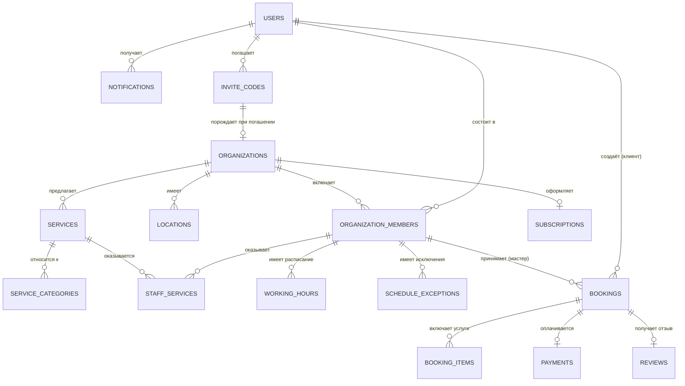

# DATABASE — Beauty.lv

Версия 0.2 (черновик для утверждения). СУБД: PostgreSQL (предложение, см. [ARCHITECTURE.md](ARCHITECTURE.md)).

## 1. Принципы проектирования

- Первичные ключи — UUID (v7 предпочтительно, для сортируемости по времени создания).
- Обязательные аудит-поля на всех бизнес-таблицах: `created_at`, `updated_at`, `deleted_at` (soft delete там, где нужна история/восстановление).
- Мультиарендность через `organization_id` на всех тенант-специфичных таблицах + индекс.
- Деньги хранятся в минимальных единицах (центы) как `integer`/`bigint`, никогда как `float`.
- Время — всегда `timestamptz` (UTC в БД), конвертация в локальный часовой пояс организации на уровне Presentation.
- Явные enum-типы для статусов вместо "магических строк".
- Внешние ключи с явно определённым поведением при удалении (`ON DELETE RESTRICT` по умолчанию для бизнес-критичных связей, `CASCADE` только для строго зависимых сущностей типа `booking_service_items`).

## 2. Обзор сущностей

## 3. Таблицы

### 3.1. `users`

Единая таблица для всех физических лиц (клиенты, мастера, админы — роль определяется через `organization_members` и системную роль).

| Поле                                 | Тип                     | Описание                                                                                                                        |
| ------------------------------------ | ----------------------- | ------------------------------------------------------------------------------------------------------------------------------- |
| id                                   | uuid, PK                |                                                                                                                                 |
| email                                | citext, unique nullable | Может отсутствовать при регистрации только по телефону                                                                          |
| phone                                | text, unique nullable   | В формате E.164                                                                                                                 |
| password_hash                        | text nullable           | Null для пользователей, вошедших только по OTP                                                                                  |
| full_name                            | text                    |                                                                                                                                 |
| avatar_url                           | text nullable           |                                                                                                                                 |
| locale                               | text                    | `lv`, `ru`, `en`                                                                                                                |
| system_role                          | enum                    | `client`, `master`, `platform_admin` (базовая роль по умолчанию; в рамках организации роль уточняется в `organization_members`) |
| email_verified_at                    | timestamptz nullable    |                                                                                                                                 |
| phone_verified_at                    | timestamptz nullable    |                                                                                                                                 |
| gdpr_consent_at                      | timestamptz             | Момент согласия на обработку ПДн                                                                                                |
| created_at / updated_at / deleted_at | timestamptz             |                                                                                                                                 |

Ограничение: хотя бы одно из `email`/`phone` обязательно (проверяется на уровне Application-слоя и/или `CHECK`-констрейнтом).

### 3.2. `organizations`

Соло-мастер или салон.

| Поле                                 | Тип                             | Описание                                                                                                                                  |
| ------------------------------------ | ------------------------------- | ----------------------------------------------------------------------------------------------------------------------------------------- |
| id                                   | uuid, PK                        |                                                                                                                                           |
| owner_user_id                        | uuid, FK → users                |                                                                                                                                           |
| name                                 | text                            |                                                                                                                                           |
| slug                                 | text, unique (case-insensitive) | Username поддомена: `{slug}.beauty.lv` — публичная страница записи и `/dashboard` организации (см. [ARCHITECTURE.md](ARCHITECTURE.md) §3) |
| type                                 | enum                            | `solo`, `salon`                                                                                                                           |
| description                          | text nullable                   |                                                                                                                                           |
| logo_url / cover_url                 | text nullable                   |                                                                                                                                           |
| default_locale                       | text                            |                                                                                                                                           |
| timezone                             | text                            | IANA timezone, напр. `Europe/Riga`                                                                                                        |
| contact_email / contact_phone        | text nullable                   |                                                                                                                                           |
| status                               | enum                            | `active`, `suspended`, `archived`                                                                                                         |
| created_at / updated_at / deleted_at |                                 |                                                                                                                                           |

### 3.3. `locations`

Физические адреса организации (для салонов с несколькими точками).

| Поле                                     | Тип              |
| ---------------------------------------- | ---------------- |
| id                                       | uuid, PK         |
| organization_id                          | uuid, FK         |
| name                                     | text             |
| address_line, city, postal_code, country | text             |
| geo_lat, geo_lng                         | numeric nullable |
| is_primary                               | boolean          |

### 3.4. `organization_members`

Связь пользователя с организацией + роль внутри неё.

| Поле                                 | Тип               | Описание                                                           |
| ------------------------------------ | ----------------- | ------------------------------------------------------------------ |
| id                                   | uuid, PK          |                                                                    |
| organization_id                      | uuid, FK          |                                                                    |
| user_id                              | uuid, FK          |                                                                    |
| role                                 | enum              | `owner`, `admin`, `master`                                         |
| location_id                          | uuid, FK nullable | Основная локация мастера                                           |
| display_name                         | text nullable     | Имя, отображаемое клиентам (может отличаться от `users.full_name`) |
| bio                                  | text nullable     |                                                                    |
| status                               | enum              | `active`, `invited`, `disabled`                                    |
| created_at / updated_at / deleted_at |                   |                                                                    |

### 3.5. `service_categories`

| Поле            | Тип      |
| --------------- | -------- |
| id              | uuid, PK |
| organization_id | uuid, FK |
| name            | text     |
| sort_order      | integer  |

### 3.6. `services`

| Поле                                 | Тип               | Описание                                |
| ------------------------------------ | ----------------- | --------------------------------------- |
| id                                   | uuid, PK          |                                         |
| organization_id                      | uuid, FK          |                                         |
| category_id                          | uuid, FK nullable |                                         |
| name                                 | text              |                                         |
| description                          | text nullable     |                                         |
| duration_minutes                     | integer           |                                         |
| buffer_after_minutes                 | integer default 0 | Время на подготовку/уборку после услуги |
| price_amount                         | integer           | В центах                                |
| price_currency                       | text              | ISO 4217, напр. `EUR`                   |
| price_type                           | enum              | `fixed`, `from`                         |
| is_active                            | boolean           |                                         |
| created_at / updated_at / deleted_at |                   |                                         |

### 3.7. `staff_services`

Какие мастера оказывают какие услуги, с возможным переопределением цены/длительности.

| Поле                      | Тип              |
| ------------------------- | ---------------- |
| id                        | uuid, PK         |
| organization_member_id    | uuid, FK         |
| service_id                | uuid, FK         |
| duration_override_minutes | integer nullable |
| price_override_amount     | integer nullable |

Уникальность: (`organization_member_id`, `service_id`).

### 3.8. `working_hours`

Регулярное недельное расписание мастера.

| Поле                   | Тип      |
| ---------------------- | -------- |
| id                     | uuid, PK |
| organization_member_id | uuid, FK |
| weekday                | smallint | 0–6 |
| start_time             | time     |     |
| end_time               | time     |     |

### 3.9. `schedule_exceptions`

Разовые отклонения (отпуск, больничный, изменение часов на конкретную дату).

| Поле                   | Тип           |
| ---------------------- | ------------- |
| id                     | uuid, PK      |
| organization_member_id | uuid, FK      |
| date                   | date          |
| is_day_off             | boolean       |
| start_time / end_time  | time nullable | Если не выходной, но изменённые часы |
| reason                 | text nullable |

### 3.10. `bookings`

Запись клиента. Одна запись может включать несколько услуг (`booking_items`).

| Поле                                   | Тип                  | Описание                                                                                     |
| -------------------------------------- | -------------------- | -------------------------------------------------------------------------------------------- |
| id                                     | uuid, PK             |                                                                                              |
| organization_id                        | uuid, FK             |                                                                                              |
| organization_member_id                 | uuid, FK             | Мастер                                                                                       |
| client_user_id                         | uuid, FK nullable    | Null, если клиент без аккаунта (гостевая запись)                                             |
| guest_name / guest_phone / guest_email | text nullable        | Для гостевой записи                                                                          |
| location_id                            | uuid, FK             |                                                                                              |
| starts_at / ends_at                    | timestamptz          |                                                                                              |
| status                                 | enum                 | `pending`, `confirmed`, `completed`, `cancelled_by_client`, `cancelled_by_master`, `no_show` |
| cancellation_reason                    | text nullable        |                                                                                              |
| source                                 | enum                 | `public_page`, `admin_manual`, `marketplace`                                                 |
| idempotency_key                        | text unique nullable | Защита от дублей при создании                                                                |
| notes                                  | text nullable        | Заметка мастера                                                                              |
| created_at / updated_at / deleted_at   |                      |                                                                                              |

**Ограничение целостности:** exclusion constraint по (`organization_member_id`, `tstzrange(starts_at, ends_at)`) исключает пересечение записей одного мастера — реализуется через `EXCLUDE USING GIST`.

### 3.11. `booking_items`

Конкретные услуги внутри записи (снапшот цены/длительности на момент бронирования — важно для истории, т.к. `services` может измениться позже).

| Поле                      | Тип      |
| ------------------------- | -------- |
| id                        | uuid, PK |
| booking_id                | uuid, FK |
| service_id                | uuid, FK |
| service_name_snapshot     | text     |
| duration_minutes_snapshot | integer  |
| price_amount_snapshot     | integer  |
| price_currency_snapshot   | text     |

### 3.12. `payments`

| Поле                    | Тип      | Описание                                                           |
| ----------------------- | -------- | ------------------------------------------------------------------ |
| id                      | uuid, PK |                                                                    |
| booking_id              | uuid, FK |                                                                    |
| type                    | enum     | `deposit`, `full_payment`                                          |
| amount                  | integer  | В центах                                                           |
| currency                | text     |                                                                    |
| provider                | enum     | `stripe`                                                           |
| provider_payment_id     | text     |                                                                    |
| status                  | enum     | `pending`, `succeeded`, `failed`, `refunded`, `partially_refunded` |
| created_at / updated_at |          |                                                                    |

### 3.13. `subscriptions`

Биллинг платформы (подписка организации на тариф Beauty.lv).

| Поле                     | Тип                                                 |
| ------------------------ | --------------------------------------------------- |
| id                       | uuid, PK                                            |
| organization_id          | uuid, FK                                            |
| plan                     | enum (`free`, `starter`, `pro`, `business`)         |
| status                   | enum (`active`, `trialing`, `past_due`, `canceled`) |
| provider_subscription_id | text                                                |
| current_period_end       | timestamptz                                         |
| created_at / updated_at  |                                                     |

### 3.14. `reviews`

| Поле                    | Тип              |
| ----------------------- | ---------------- |
| id                      | uuid, PK         |
| booking_id              | uuid, FK, unique |
| rating                  | smallint         | 1–5 |
| comment                 | text nullable    |
| master_reply            | text nullable    |
| is_published            | boolean          |
| created_at / updated_at |                  |

### 3.15. `notifications`

| Поле       | Тип                                                                                                      |
| ---------- | -------------------------------------------------------------------------------------------------------- |
| id         | uuid, PK                                                                                                 |
| user_id    | uuid, FK nullable                                                                                        |
| booking_id | uuid, FK nullable                                                                                        |
| channel    | enum (`email`, `sms`, `push`)                                                                            |
| type       | enum (`booking_created`, `booking_confirmed`, `booking_reminder`, `booking_cancelled`, `review_request`) |
| status     | enum (`queued`, `sent`, `failed`)                                                                        |
| payload    | jsonb                                                                                                    |
| sent_at    | timestamptz nullable                                                                                     |
| created_at | timestamptz                                                                                              |

### 3.16. `invite_codes`

Инвайт-коды для закрытой регистрации мастеров (MVP, см. [ARCHITECTURE.md](ARCHITECTURE.md) §10.1). Открытая самостоятельная регистрация в MVP отсутствует — организация может быть создана только через погашение действующего кода.

| Поле                                     | Тип                                | Описание                                                       |
| ---------------------------------------- | ---------------------------------- | -------------------------------------------------------------- |
| id                                       | uuid, PK                           |                                                                |
| code                                     | text, unique                       | Человекочитаемый код (напр. 8 символов), генерируется системой |
| issued_by_user_id                        | uuid, FK → users                   | Платформенный админ, выпустивший код                           |
| intended_for_name / intended_for_contact | text nullable                      | Кому код выдан физически — для трекинга/поддержки              |
| status                                   | enum                               | `active`, `used`, `revoked`, `expired`                         |
| expires_at                               | timestamptz nullable               |                                                                |
| used_by_user_id                          | uuid, FK → users, nullable         |                                                                |
| used_at                                  | timestamptz nullable               |                                                                |
| created_organization_id                  | uuid, FK → organizations, nullable | Организация, созданная при погашении кода                      |
| created_at / updated_at                  |                                    |                                                                |

Погашение кода — часть одной транзакции регистрации (создание `users` + `organizations` + `organization_members` + пометка кода `used`), см. [ARCHITECTURE.md](ARCHITECTURE.md) §10.1. Повторное использование одноразового кода — ошибка `409` на уровне API (см. [API.md](API.md)).

### 3.17. `audit_log`

| Поле                    | Тип               |
| ----------------------- | ----------------- |
| id                      | uuid, PK          |
| organization_id         | uuid, FK nullable |
| actor_user_id           | uuid, FK nullable |
| action                  | text              |
| entity_type / entity_id | text / uuid       |
| metadata                | jsonb             |
| created_at              | timestamptz       |

## 4. Индексы (ключевые)

- `bookings(organization_member_id, starts_at)` — для расчёта доступности и вывода расписания.
- `bookings(organization_id, starts_at)` — для дашборда организации.
- `services(organization_id)`, `organization_members(organization_id)` — базовые tenant-индексы.
- `users(email)`, `users(phone)` — уникальные, для логина.
- GIST-индекс на диапазон времени `bookings` для exclusion constraint (см. 3.10).

## 5. GDPR и хранение данных

- Право на удаление: soft-delete пользователя с последующей анонимизацией (`full_name`, `email`, `phone` → замена на плейсхолдеры) через N дней после запроса на удаление, при сохранении обезличенных агрегатов для отчётности.
- Право на экспорт: use-case, собирающий все записи пользователя (`bookings`, `reviews`, `notifications`) в машиночитаемый формат (JSON).
- Хранение платёжных данных (номера карт и т.п.) — **никогда** напрямую в БД Beauty.lv; только через tokenization провайдера (Stripe).
- Регион хостинга БД — ЕС (требование резидентности данных).

## 6. Стратегия миграций

- Миграции — версионируемые SQL-файлы (или через выбранный ORM/инструмент), применяются автоматически в CI/CD перед деплоем backend (см. [DEPLOYMENT.md](DEPLOYMENT.md)).
- Каждая миграция — маленькая и обратимая там, где это возможно (`up`/`down`).
- Изменения, ломающие обратную совместимость (удаление колонки и т.п.), — только в 2 этапа (deprecate → remove в следующем релизе).

## 7. Открытые вопросы

1. UUID v7 vs. v4 — зависит от финального выбора ORM/драйвера и его поддержки.
2. Нужен ли отдельный read-replica уже в MVP, или это Phase 5 (текущее решение: не в MVP).
3. Финальный список тарифных планов `subscriptions.plan` — согласуется с бизнес-моделью (см. [PRD.md](PRD.md) §5).
